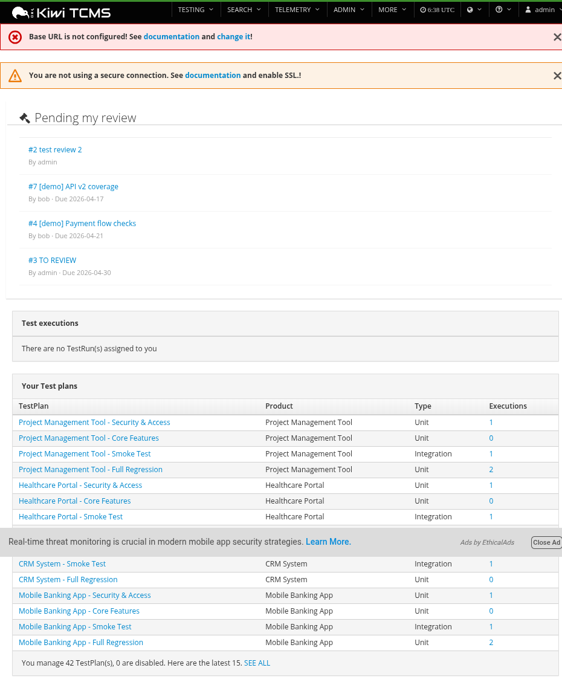
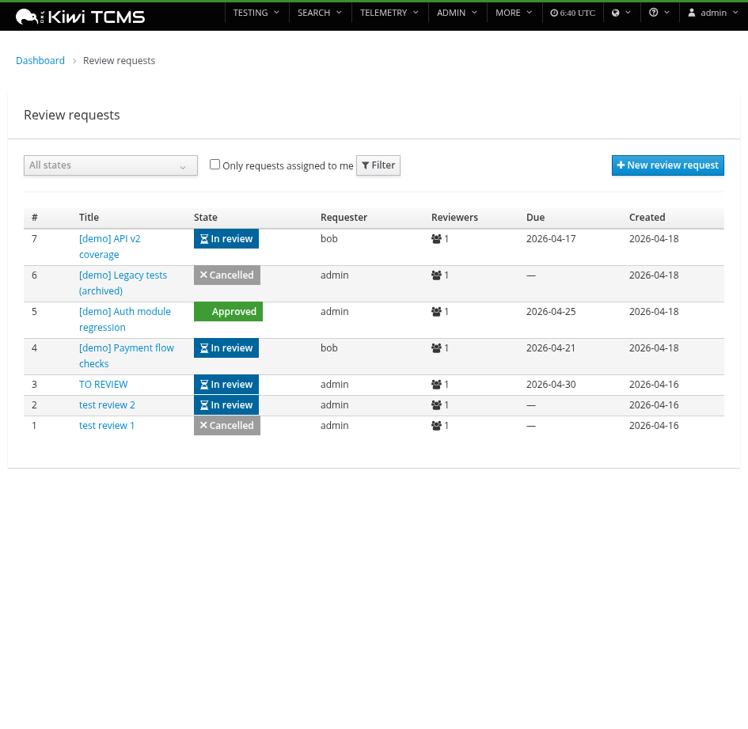
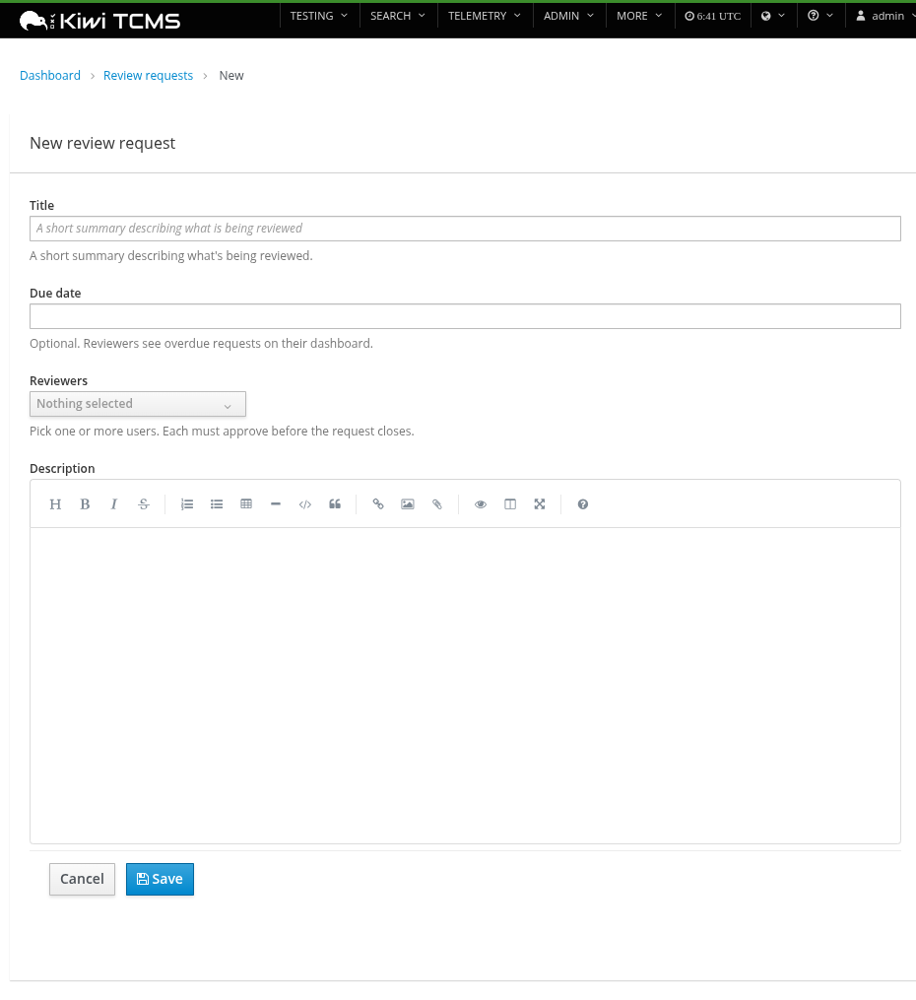
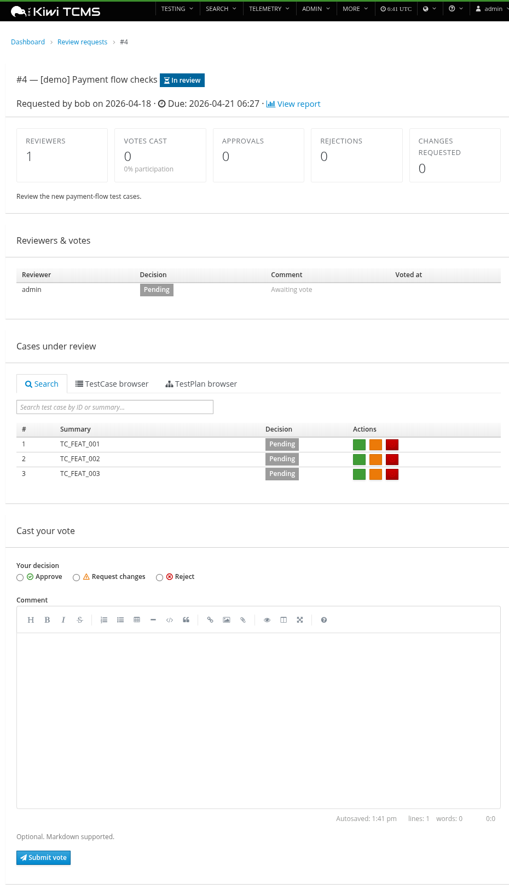
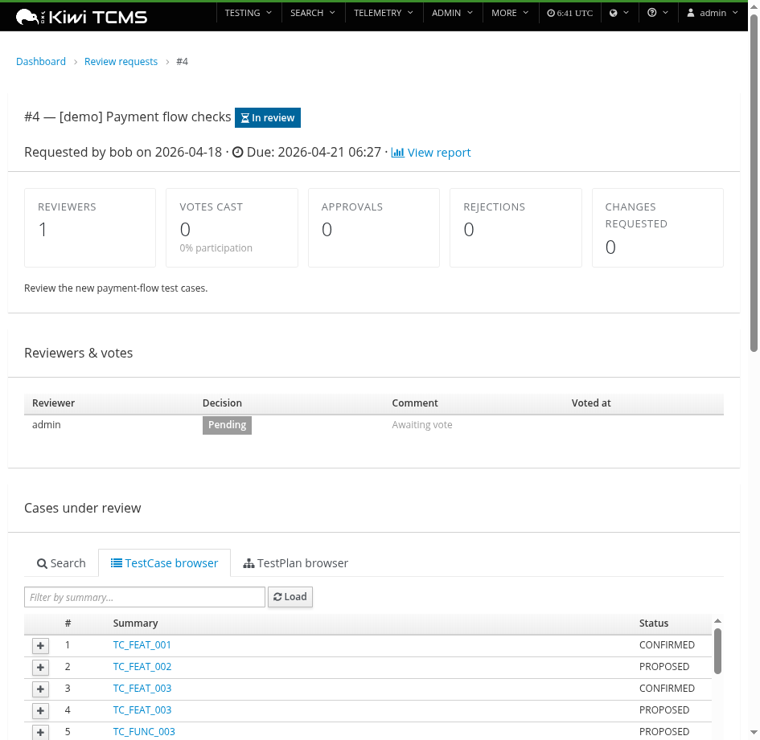
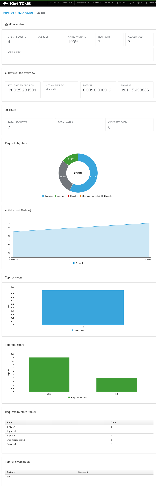
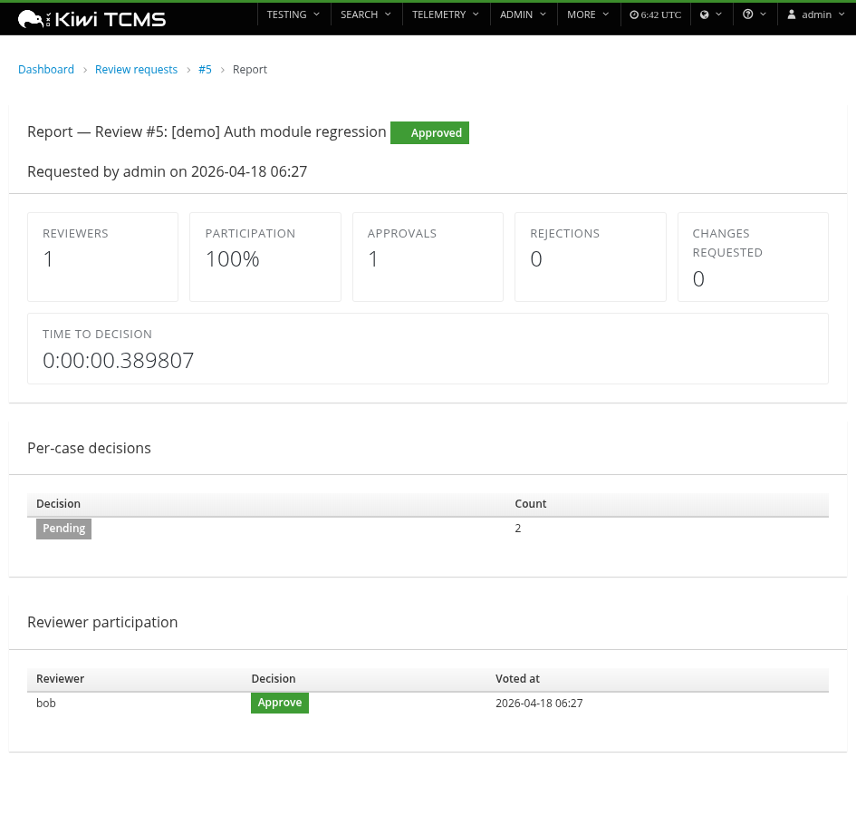
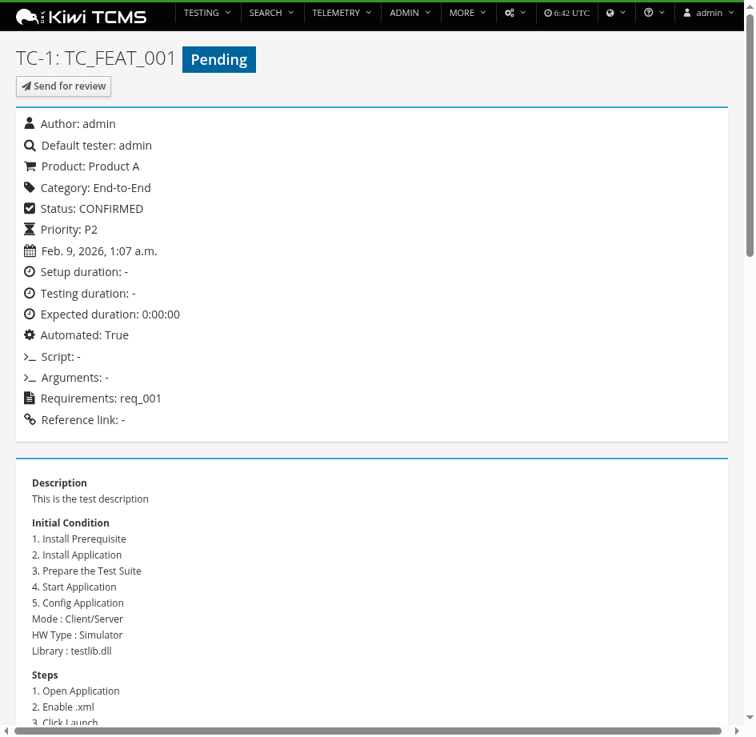
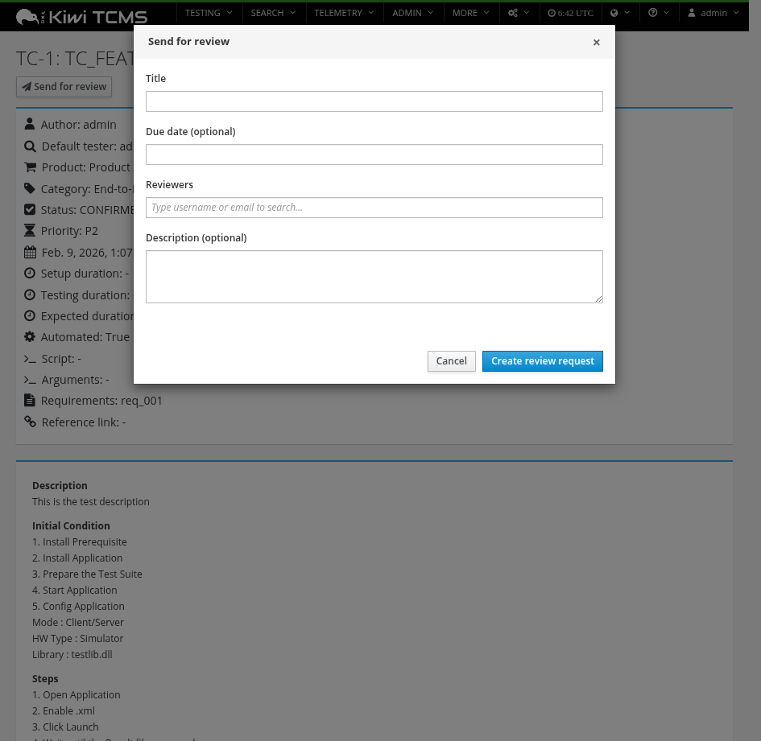

# kiwitcms-review

**Test case review workflow plugin for [Kiwi TCMS](https://kiwitcms.org/).**

Group test cases into a structured **Review Request**, assign reviewers, collect per-reviewer votes and per-case decisions, notify by email, track KPIs, and report on completed sessions — all without modifying the Kiwi TCMS core codebase.



---

## Table of contents

- [Features](#features)
- [Screenshots](#screenshots)
- [Installation](#installation)
- [Configuration](#configuration)
- [Permissions](#permissions)
- [XML-RPC / JSON-RPC API](#xml-rpc--json-rpc-api)
- [How the plugin hooks into Kiwi](#how-the-plugin-hooks-into-kiwi)
- [Development](#development)
- [Compatibility](#compatibility)
- [License](#license)

---

## Features

- **Review Request** — group one or more `TestCase` objects into a single review cycle with title, description (markdown), due date, and a state machine
- **Per-reviewer votes** — `Approved` / `Needs changes` / `Rejected`, with optional markdown comments
- **Per-case decisions** — track approval status for each case in the request, with inline one-click decision buttons
- **Automatic state transitions** — request transitions to `Approved` / `Rejected` / `Changes requested` once votes are in, via a pure state machine
- **Email notifications** — reviewers notified on assignment, requester notified on votes and state changes (via Kiwi's existing `mailto` helper)
- **Dashboard "Pending my review" widget** — injected into the Kiwi dashboard via JS, no core template edits
- **"Send for review" button** — injected into TestCase and TestPlan detail pages; opens a Bootstrap modal with title / due date / reviewer typeahead / description
- **Per-case status badge** — injected next to the TestCase title showing the latest review decision with a link to the parent request
- **TestCase + TestPlan browser** — on the review detail page, tab through all cases or plans to add them to the review in bulk
- **XML-RPC & JSON-RPC API** — 13 methods covering create / filter / cancel / vote / metrics / add-case / add-reviewer etc.
- **Statistics dashboard** with 4 charts — state distribution (donut), 30-day activity (area spline), top reviewers (bar), top requesters (bar)
- **KPI overview** — open requests, overdue, approval rate, 30-day counters
- **Review time overview** — average / median / fastest / slowest time-to-decision
- **Per-session reporting** — vote breakdown, time-to-decision, reviewer participation
- **Configurable status filter** — by default only `PROPOSED` test cases can be submitted; override via `REVIEW_ALLOWED_CASE_STATUSES` setting
- **Full audit trail** — `django-simple-history` shadow tables on every model

## Screenshots

### Dashboard integration

Injects a "Pending my review" card into the Kiwi dashboard listing every open review request assigned to the current user.


### Review list

Filterable list of all review requests with colour-coded state badges.



### New review request

Markdown-enabled form with date picker, reviewer selectpicker, and a proper breadcrumb.



### Review detail

KPI strip, reviewer-and-votes table, cases-under-review table with inline per-case decision buttons, and a markdown vote form.



### TestCase / TestPlan browser

Bulk-add cases either by searching or by drilling into a test plan.



### Statistics dashboard

KPI cards, review-time overview, and four C3.js charts summarising the whole review process.



### Per-session report

Drill into any request to see the full metrics — participation, time to decision, per-case counts, and per-reviewer activity.



### TestCase detail — injected button and badge

The plugin grafts a status badge (next to the case title) and a "Send for review" button onto every TestCase detail page without touching the core template.



### Send-for-review modal

Click the button to open a modal with username typeahead and a date picker, all wired to the plugin's JSON-RPC API.



---

## Installation

### From PyPI (once published)

```bash
pip install kiwitcms-review
./manage.py migrate tcms_review
./manage.py collectstatic --noinput
```

### From source (editable install)

```bash
git clone https://github.com/veenone/kiwi-tcms-review-workflow.git
pip install -e kiwi-tcms-review-workflow
./manage.py migrate tcms_review
./manage.py collectstatic --noinput
```

That's it. Kiwi auto-discovers the plugin via the `kiwitcms.plugins` entry point and:

- adds `tcms_review` to `INSTALLED_APPS`
- mounts the URLs at `/reviews/`
- adds the menu items to the **MORE** menu
- registers the XML-RPC methods (done in the plugin's `apps.py::ready()`)
- injects the client-side bundle into every HTML response (via a response middleware, also registered in `ready()`)

Restart your Kiwi process after install.

---

## Configuration

All settings are optional.

| Setting | Default | Purpose |
|---|---|---|
| `REVIEW_ALLOWED_CASE_STATUSES` | `["PROPOSED"]` | List of `TestCaseStatus.name` values that can be submitted for review. Both the HTML views and the RPC `ReviewRequest.add_case` method enforce this list. |
| `REVIEW_STATUS_TRANSITIONS` | `{}` | Auto-transition map for `TestCase.case_status` when a per-case review decision is set. Keys are `(source_status_name, decision)` tuples (decision: `approved` / `rejected` / `needs_changes`); values are target status names. |

Example in `tcms_settings_dir/review.py` or your own `local_settings.py`:

```python
REVIEW_ALLOWED_CASE_STATUSES = ["PROPOSED", "CONFIRMED"]

REVIEW_STATUS_TRANSITIONS = {
    ("PROPOSED", "approved"):       "CONFIRMED",
    ("PROPOSED", "needs_changes"):  "NEED_UPDATE",
    ("PROPOSED", "rejected"):       "DISABLED",
    ("CONFIRMED", "needs_changes"): "NEED_UPDATE",
}
```

With this config, clicking "Needs changes" on any `PROPOSED` or `CONFIRMED` case flips its status to `NEED_UPDATE` automatically. The transition is captured in the audit trail via `django-simple-history`.

---

## Permissions

On first migrate, four Django permissions are created and auto-granted to the built-in `Tester` group:

| Permission | Purpose |
|---|---|
| `tcms_review.add_reviewrequest` | Create review requests |
| `tcms_review.change_reviewrequest` | Be a reviewer, cast votes, cancel, add cases |
| `tcms_review.view_reviewrequest` | Browse list and detail pages, call read-only RPC methods |
| `tcms_review.delete_reviewrequest` | Admin only |

Some operations have additional object-level guards beyond the permission:

- **Voting** — the user must be in the request's `reviewers` M2M and the request must not be cancelled
- **Cancelling** — only the original requester can cancel

---

## XML-RPC / JSON-RPC API

All methods are registered under `MODERNRPC_METHODS_MODULES` and available at `/xml-rpc/` and `/json-rpc/`. Same authentication model as Kiwi core RPC methods.

### `ReviewRequest`

| Method | Permission | Purpose |
|---|---|---|
| `create(values)` | `add_reviewrequest` | Create a new request. `values` validated through the same form the HTML view uses. |
| `filter(query)` | `view_reviewrequest` | List requests matching the query dict. |
| `filter_canonical(query)` | `view_reviewrequest` | List IDs only. Mirrors `Bug.filter_canonical`. |
| `add_case(request_id, case_id)` | `change_reviewrequest` | Attach a test case. Enforces `REVIEW_ALLOWED_CASE_STATUSES`. |
| `remove_case(request_id, case_id)` | `change_reviewrequest` | Detach a test case. |
| `add_reviewer(request_id, user_id)` | `change_reviewrequest` | Add a reviewer. |
| `remove_reviewer(request_id, user_id)` | `change_reviewrequest` | Remove a reviewer, triggers state recalculation. |
| `cancel(request_id)` | `change_reviewrequest` + owner-only | Cancel the request. |
| `metrics(request_id)` | `view_reviewrequest` | Returns `{state, votes, items, participation, time_to_decision_seconds}`. |

### `ReviewVote`

| Method | Permission | Purpose |
|---|---|---|
| `cast(request_id, decision, comment)` | `change_reviewrequest` + reviewer guard | Cast or revise the caller's vote; triggers state recompute. |
| `filter(query)` | `view_reviewrequest` | List votes matching the query. |

### `ReviewItem`

| Method | Permission | Purpose |
|---|---|---|
| `set_decision(item_id, decision, comment)` | `change_reviewrequest` | Update the per-case decision. |
| `filter(query)` | `view_reviewrequest` | List items matching the query. Used internally by the per-case badge injector. |

### Example — Python

```python
from tcms_api import TCMS
rpc = TCMS().exec

request = rpc.ReviewRequest.create({
    "title": "Payment flow audit",
    "description": "Please review the new payment-flow test cases.",
    "due_date": "2026-05-01 17:00",
    "reviewers": [12, 34],
})

rpc.ReviewRequest.add_case(request["id"], 100)
rpc.ReviewRequest.add_case(request["id"], 101)

rpc.ReviewVote.cast(request["id"], "approved", "LGTM")

metrics = rpc.ReviewRequest.metrics(request["id"])
```

---

## How the plugin hooks into Kiwi

The plugin is a self-contained Django app that piggybacks on Kiwi's existing plugin contract. **It never edits any Kiwi core file.**

| Concern | Mechanism |
|---|---|
| `INSTALLED_APPS` | Auto — any module listed under `kiwitcms.plugins` entry point is appended (Kiwi's `settings/common.py`) |
| URL routing | Auto — each plugin's `urls.py` is mounted at `^<entry-point-name>/` (Kiwi's `urls.py:62`). We use `reviews` → `/reviews/` |
| MORE menu | Auto — each plugin's `menu.MENU_ITEMS` is appended |
| `MODERNRPC_METHODS_MODULES` | **Manual** — we register methods directly into the modernrpc registry from `apps.py::ready()`, because modernrpc's `ready()` runs before plugin `ready()` and would otherwise miss our methods |
| Middleware | **Manual** — `apps.py::ready()` appends `InjectReviewBundleMiddleware` to `settings.MIDDLEWARE` |
| Dashboard widget | JS injection from `inject.js` — detects body id / URL, grafts a DOM node |
| Send-for-review button | JS injection — same mechanism |
| Per-case status badge | JS injection — calls `/reviews/json/case/<pk>/latest/` on TestCase detail pages |
| Email | Reuses Kiwi's public `tcms.core.utils.mailto.mailto()` helper |

**Two-jQuery rule** — Kiwi ships two jQuery instances (`$` with Bootstrap plugins, `jQuery` plain). The plugin's IIFE wrappers MUST close with `})($)`.

---

## Development

### Run the unit tests

```bash
python -m unittest tcms_review.tests.test_state_machine
```

The state machine tests are pure Python and require no Django setup. DB-dependent tests are in `test_models.py`, `test_views.py`, `test_permissions.py`, `test_signals.py`, `test_reports.py`, and `test_api.py` — run them against a Kiwi dev install:

```bash
./manage.py test tcms_review --settings=tcms.settings.test
```

### Build the wheel

```bash
pip install -e ".[dev]"
python -m build
```

Produces `dist/kiwitcms_review-<version>-py3-none-any.whl` and a source tarball.

### Upload to PyPI

```bash
python -m twine upload dist/*
```

### Lint

No enforced lint yet. The code follows black/flake8 conventions.

---

## Compatibility

| | Version |
|---|---|
| Kiwi TCMS | ≥ 12.0 (tested against 15.3) |
| Python | ≥ 3.9 |
| Django | ≥ 3.2 (tested against 5.2) |
| `django-simple-history` | ≥ 3.0 |
| `django-modern-rpc` | ≥ 1.0 |

## License

GPL-2.0-or-later. Matches Kiwi TCMS.

## Author

Achmad Fienan Rahardianto — [veenone@gmail.com](mailto:veenone@gmail.com)

## Links

- [Repository](https://github.com/veenone/kiwi-tcms-review-workflow)
- [Issues](https://github.com/veenone/kiwi-tcms-review-workflow/issues)
- [Kiwi TCMS](https://kiwitcms.org/)
